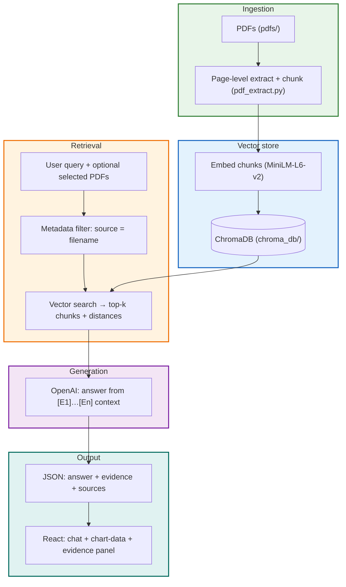

# Financial Intelligence Portal — Judge Briefing

**One-page orientation for demos and Q&A.** This document explains what the system does, how data flows end-to-end, how retrieval and page indexing work, and how scoped (selected-PDF) answers are enforced.

---

## 1. What this project is

A **Retrieval-Augmented Generation (RAG)** web application for **financial PDFs** (e.g. 10-K / 10-Q–style filings). Users upload or select PDFs, ask questions in natural language, and receive answers that are **grounded in retrieved text** from those documents—not from generic web knowledge. The UI shows **sources**, **page references** (when available), **evidence snippets**, **confidence-style scores**, and optional **charts** when numeric `chart-data` is present.

### Visual architecture (color-coded)

Use this in slides or any Mermaid-capable viewer; each **subgraph** is a colored stage.



| Box color | Stage |
|-----------|--------|
| Green | Ingestion: PDF → page chunks + metadata (`source`, `page`) |
| Blue | Vectorization + persistence in ChromaDB |
| Orange | Retrieval: embed query, filter by scope, rank by similarity |
| Purple | Generation: LLM uses only retrieved labeled context |
| Teal | Output: API + UI (evidence, optional Recharts graph) |

---

## 2. End-to-end pipeline (high level)

1. **PDFs** → placed under `pdfs/` (or uploaded via the UI).
2. **Ingestion** → text is extracted **per page**, split into **chunks**, and each chunk gets **metadata** (including `source` = filename, `page` = page number).
3. **Embedding** → each chunk is converted to a vector using **SentenceTransformers** (`all-MiniLM-L6-v2`).
4. **Storage** → vectors + text + metadata live in a **local ChromaDB** database (`chroma_db/`, collection `financial_docs`).
5. **Query** → user question is embedded; **nearest chunks** are retrieved from Chroma.
6. **Scope (optional)** → if the user selects specific PDFs in the sidebar, retrieval is **restricted** to chunks whose metadata `source` matches those filenames (and, for multi-file questions, retrieval is **balanced** across files so comparisons are fair).
7. **Generation** → a **large language model** (OpenAI) receives only the **retrieved chunks** (labeled `[E1]`, `[E2]`, …) and produces the answer.
8. **Evidence API** → the backend returns structured **evidence** (source, page, excerpt, distance, rank-based confidence) for transparency and for the UI.
9. **Charts** → if the model outputs a fenced ` ```chart-data``` ` JSON block, the React UI renders a **Recharts** chart; the backend may supply a **fallback** chart dataset if the model omits one.

---

## 3. How PDFs are processed and “vectorized”

| Step | Where | What happens |
|------|--------|----------------|
| Open PDF | `pdf_extract.py` | PyMuPDF (`fitz`) opens each file. |
| Page loop | `pdf_extract.py` | Text is read **page by page** (not as one giant blob). |
| Chunking | `pdf_extract.py` | Each page’s text is split into overlapping word chunks (size/overlap configurable). |
| Metadata | `pdf_extract.py` | Every chunk stores `source` (filename), `page` (1-based), and identifiers. Chunk IDs encode page when possible (e.g. `..._p12_...`). |
| Rich metadata | `pdf_extract.py` | Each chunk also stores **`extraction_method`**: `native` (PyMuPDF text / tables) or `paddleocr` (rendered page OCR), and **`content_type`**: `paragraph`, `table`, or `image_ocr`. Table rows from PyMuPDF’s `find_tables()` are stored as `content_type=table`; OCR uses heuristics to label `table` vs `image_ocr`. |
| Batch upload | `main.py` / `ingestion.py` | Chunks are passed to `vector_store.add_documents()`. Re-uploading a file **deletes** old vectors for that `source` first, then re-adds. |

**Why page-level indexing matters:** citations can point to **which page** a snippet came from. If older data was indexed before page metadata existed, **page may show as unknown** until PDFs are re-ingested.

### OCR and tables (what judges see in evidence)

- **Native tables:** PyMuPDF detects tables where supported; cell text is joined with tabs/newlines, embedded like any other chunk, tagged **`extraction_method: native`**, **`content_type: table`**, optional **`table_id`**.
- **Scanned / low-text pages:** If native text on a page is shorter than **`MIN_NATIVE_TEXT_CHARS`** (default 50), the pipeline renders the page and runs **PaddleOCR** (if installed). Chunks are tagged **`extraction_method: paddleocr`** and **`content_type: image_ocr`** or **`table`** (simple line/tab heuristics).
- **Evidence / UI:** Each retrieved snippet can show labels like **`content_type: table, extraction_method: paddleocr, page: 12`** in the API, the **Retrieval evidence** footer, and the **Evidence & sources** panel.

Set **`USE_PADDLE_OCR=0`** in the environment to skip PaddleOCR. After changing extraction logic, **re-ingest** PDFs so Chroma gets new metadata.

### Evaluation benchmarks (references)

Use these as **external standards** when comparing OCR + table RAG quality—not all are pre-wired in the repo:

| Benchmark | What it measures |
|-----------|-------------------|
| **DocVQA** | Question answering over document images (scanned / layout). |
| **PubTabNet** / **FinTabNet** | Table structure and content extraction from documents. |
| **WikiTableQuestions (WTQ)** | QA over semi-structured tables (reasoning + retrieval). |
| **Custom corpus QA** | Gold Q&A pairs on your own PDFs; report **Exact Match / F1** and **citation accuracy** (does the cited chunk contain the answer?). |

**Quick internal check:** After ingestion, count Chroma documents grouped by **`content_type`** and **`extraction_method`** in metadata to verify how many **table** vs **image_ocr** vs **paragraph** chunks were indexed.

---

## 4. Where vectors are stored

- **Engine:** ChromaDB (persistent client).
- **Path:** `chroma_db/` (project root, resolved via `paths.py` so it works regardless of shell working directory).
- **Collection:** `financial_docs`.
- **Embedding model:** `all-MiniLM-L6-v2` (SentenceTransformers), configured in `vector_store.py`.

---

## 5. How retrieval works for a user query

1. The user question is turned into an **embedding** using the same embedding function Chroma uses for stored chunks.
2. Chroma runs a **nearest-neighbor search** and returns, for each hit:
   - `documents` (chunk text),
   - `metadatas` (e.g. `source`, `page`),
   - `distances` (similarity distance in embedding space),
   - `ids` (chunk ids).
3. The router (`router.py`) builds **context strings** and **evidence rows** from these results.

**Distance vs. confidence:** `vector_distance` is the raw Chroma distance. A **display confidence score** is a **heuristic** (rank + `exp(-distance)` blend), useful for **ranking transparency**, not a calibrated statistical probability.

---

## 6. How “select PDFs” restricts answers (scoped RAG)

- The React sidebar sends `selected_files` (filenames) to `POST /api/ask`.
- Chroma queries are filtered with metadata:
  - **One file:** `where: { "source": "ExactName.pdf" }`
  - **Multiple files:** `where: { "$or": [ { "source": "A.pdf" }, { "source": "B.pdf" } ] }`
- **Post-filtering:** retrieved rows are also checked in Python so only allowed `source` values are used.
- **Multi-file comparison:** when several PDFs are scoped, the system runs **per-file retrieval** and merges results so **each selected document contributes chunks**, not only the single globally best-matching file.

This is how the model’s context is **limited to user-selected PDFs**.

---

## 7. Evidence, sources, and confidence (what judges see)

For each answer, the API includes:

- **`evidence`**: list of items with `source`, `page`, `excerpt`, `vector_distance`, `retrieval_rank`, `confidence_score`.
- **`sources_summary`**: short string summary for the UI.
- **`answer`**: may end with a backend-appended **`### Retrieval evidence`** section built from the same retrieval list (so the written footer matches the UI).

**Grounding rule:** prompts instruct the model to cite `[E#]` and avoid hallucinating beyond retrieved context; additional consistency checks reduce contradictory “no evidence” wording when chunks exist.

---

## 8. How graphs work

- The LLM may output a fenced **` ```chart-data``` `** JSON array.
- The frontend (`MainChat.jsx`) parses that JSON and renders a **Recharts** line chart.
- If the model does not output chart JSON, the backend can **append a fallback** `chart-data` dataset so a chart still renders (often derived from evidence fields such as confidence vs. label).

**Important:** graphs are **visual summaries** of structured JSON in the model response (or fallback). They are not a separate database; they are derived from the **same retrieval + answer pipeline**.

---

## 9. Budget and model escalation (cost control)

- `budget_manager.py` tracks token usage and estimated cost.
- Primary model: **`gpt-4o-mini`**.
- If the model outputs exactly **`ESCALATE`**, the system may call **`gpt-4o`** when budget allows.
- Above a configured spend threshold, escalation is disabled to avoid runaway API cost.

---

## 10. How to run a clean demo

1. Set `OPENAI_API_KEY` in `.env` at project root.
2. `pip install -r requirements.txt` then `python3 main.py` (backend).
3. `cd frontend && npm install && npm run dev` (UI).
4. If backend is not on port 8000, set `VITE_API_URL` in `frontend/.env` and restart Vite.
5. Put PDFs in `pdfs/` or use **Fast-Upload** in the UI.
6. Select PDFs → **Scope Chat** → ask a question → expand **Evidence & sources**.

---

## 11. Key source files (for technical judges)

| Concern | File(s) |
|---------|---------|
| Page-aware PDF chunking, tables, optional PaddleOCR | `pdf_extract.py`, `ocr_paddle.py` |
| Ingestion orchestration | `ingestion.py` |
| Chroma + embeddings | `vector_store.py` |
| Paths (`pdfs/`, `chroma_db/`) | `paths.py` |
| API routes | `main.py` |
| Retrieval, evidence, prompts, charts | `router.py` |
| Chat UI + chart rendering | `frontend/src/components/MainChat.jsx` |
| API base URL | `frontend/src/config.js` |

---

## 12. One-sentence “elevator pitch”

**We index financial PDFs into a local vector database with page-level chunks, retrieve only relevant passages per question (optionally scoped to selected filings), and generate grounded answers with evidence, confidence signals, and optional charts—under a strict API budget.**
