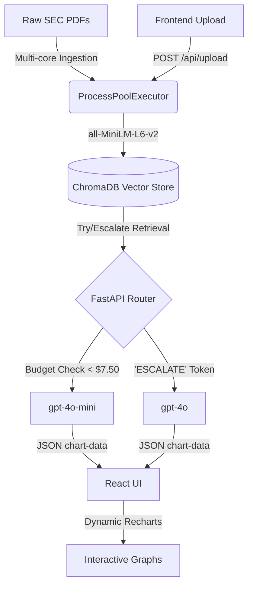

# Financial Intelligence Portal - Agentic RAG for SEC Filings 🚀

An ultra-efficient, budget-restricted **Retrieval-Augmented Generation (RAG)** platform designed to analyze deep financial SEC filings in real-time. Built specifically for the CIT Hackathon 2026 under a strict **$8 API constraint**.

 

## 🧠 System Architecture

The core architecture routes dense financial matrices into dynamic LLM contexts dynamically. 



## ⭐️ Key Features Showcase

### 1. Try/Escalate Router
Rather than burning through API credits blindly, our routing engine physically enforces models to assess their own confidence. `gpt-4o-mini` handles primary RAG contexts. If it explicitly detects deep multi-document reasoning beyond its abilities, it natively outputs an `ESCALATE` token, instantly tripping an upstream handoff to `gpt-4o`.

### 2. Hard Circuit Breaker ($8 Limit)
To prevent API billing overruns, `budget_manager.py` enforces a strict mathematical lock. Every single prompt token and completion token is tracked locally. If the cumulative pipeline cost breaches **$7.50**, the system physically severs `gpt-4o` routes and throttles all traffic backward exclusively to `gpt-4o-mini`, effectively ensuring we never break the $8 quota constraint.

### 3. Dynamic Document Scoping
Users aren't locked into querying the entire database. Check the boxes in the React Sidebar, and the frontend transmits active `$in` metadata restrictions into the ChromaDB search algorithm. The model only receives data from documents you explicitly requested.

### 4. Auto-Graphing Integration
The Agentic Router injects an absolute prompt override forcing numerical comparisons into ```chart-data``` syntax. The React frontend actively intercepts these markdown blocks and converts them mid-stream into beautiful, fully interactive Recharts `<LineChart>` overlays mimicking terminal dynamics.

---

## 💻 Local Setup Instructions

Be sure to follow these exact steps to launch the intelligence nodes locally.

### Step 1: Prepare the Target Data
1. Compile your target SEC filings and `.pdf` documents and save them.
2. In the root directory, create a `.env` file containing your key:
```txt
OPENAI_API_KEY=sk-proj-YOUR_EXACT_API_KEY_HERE
```

### Step 2: The Logic Engine (Backend)
Open a terminal in the root directory.
```bash
# Install the required heavy machine-learning vectors and FastAPI endpoints
pip install -r requirements.txt

# Launch Application
python3 main.py
```
> [!NOTE]
> *On first boot, the backend server automatically initiates parallel multiprocessing to scrape and embed the data into ChromaDB. MPS (Apple Silicon) or CUDA acceleration is automatically allocated if present!*

### Step 3: The Canvas (Frontend)
Open a completely **separate** terminal window and navigate to the UI build directory:
```bash
cd frontend

# Force install Recharts, Vite, and Markdown components
npm install --force

# Boot application
npm run dev
```

Browse to `http://localhost:5173` locally to boot up the Intelligence layout. Live uploading and scope filtering are available natively.
